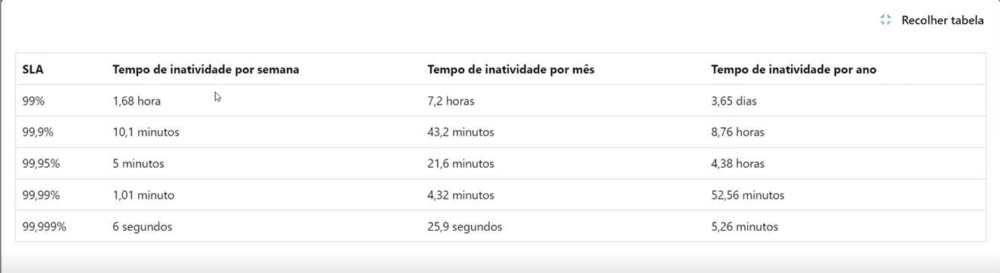
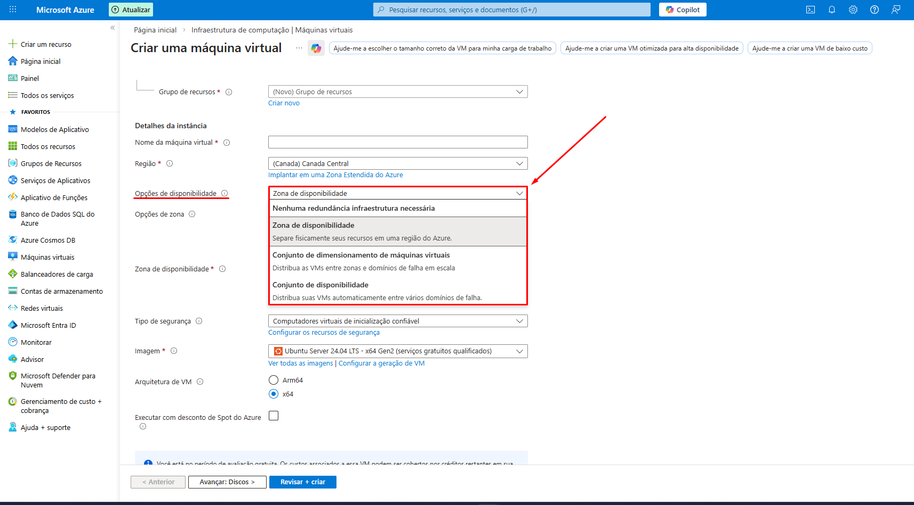
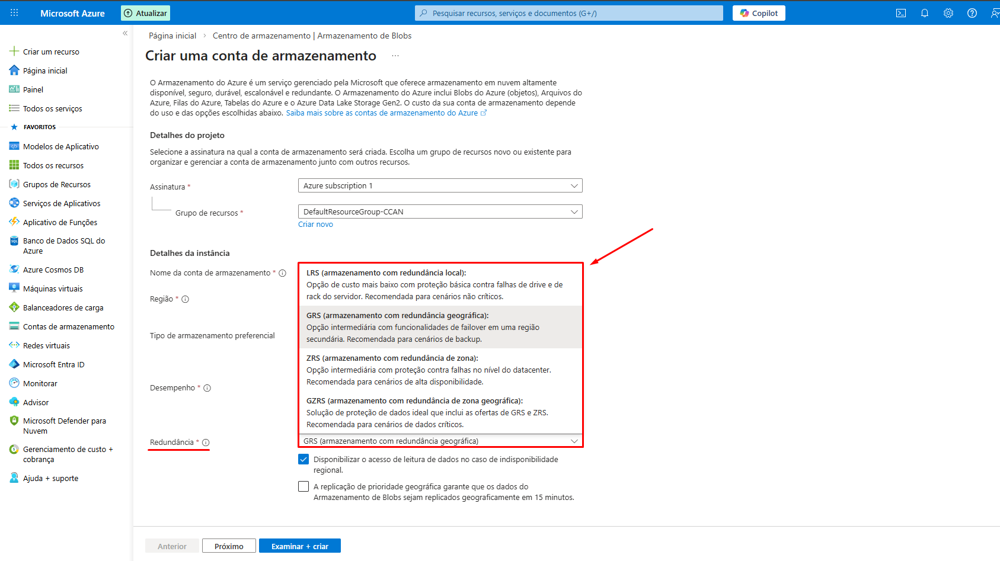
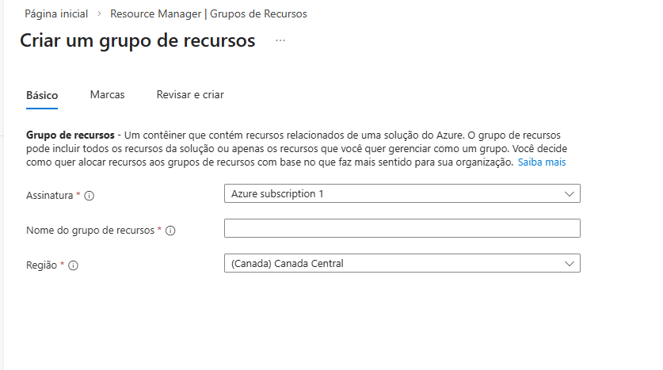
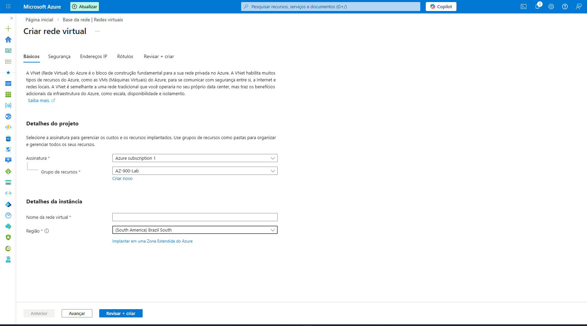
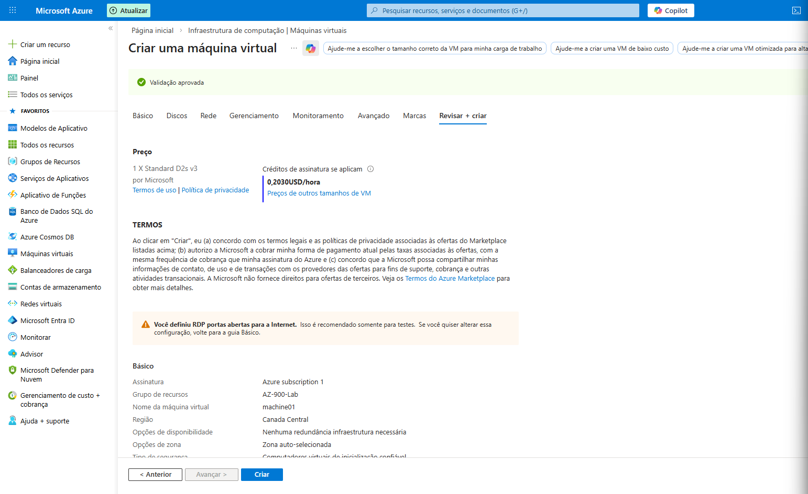

# Dominando Modelos de Nuvem e Economia de Cloud | AZURE AZ-900 ☁️

Este repositório faz parte dos meus estudos para **AZURE AZ-900** e aborda os conceitos fundamentais de modelos de implantação de nuvem.

---

## 🏗️ Modelos de Implantação

### 1. Nuvem Privada (Private Cloud)
Utilizada exclusivamente por uma única empresa em seu próprio datacenter.
* **Controle:** Total sobre os recursos, segurança e hardware.
* **Responsabilidade:** A organização é responsável pela manutenção, atualizações e operação dos serviços.
* **Restrição:** Não fornece acesso a usuários externos à rede da empresa.

### 2. Nuvem Pública (Public Cloud)
Recursos e serviços fornecidos por um provedor (como Azure) e acessados via internet.
* **Agilidade:** Aplicativos podem ser provisionados e removidos rapidamente.
* **Escalabilidade:** Escala vertical e horizontal conforme a demanda.
* **Economia:** Sem despesa de capital inicial; paga-se apenas pelo que for utilizado.

### 3. Nuvem Híbrida (Hybrid Cloud)
O "melhor dos dois mundos", conectando o ambiente local (*on-premises*) à nuvem pública.
* **Flexibilidade:** A empresa define onde executar os recursos com base em segurança e conformidade legal.
* **Interconectividade:** A nuvem privada interage diretamente com a pública para otimizar cargas de trabalho.

---

## 💸 Modelos de Custo: CapEx vs. OpEx

A transição para a nuvem geralmente representa uma mudança do modelo **CapEx** para o **OpEx**.

### CapEx (Despesas de Capital)
Refere-se ao investimento inicial em infraestrutura física.
* **Exemplo:** Construção de um datacenter local.
* **Características:** Gasto inicial elevado; o valor dos ativos reduz (depreciação) com o tempo.

### OpEx (Despesas Operacionais)
Refere-se aos gastos contínuos com produtos e serviços.
* **Exemplo:** Pagamento de máquinas virtuais e serviços em nuvem.
* **Características:** Modelo baseado em consumo; cobrança imediata e proporcional ao uso; sem custos de manutenção de hardware.

---

## 📊 Modelo de Consumo
Na computação em nuvem, o modelo de consumo garante que a empresa:
1.  Pague apenas pelo que utilizar.
2.  Tenha previsão de custos baseada no uso real.
3.  Elimine o desperdício de recursos ociosos.

---

## 🚀 Benefícios e Operação na Nuvem (Azure)

Nesta seção, detalho os pilares que sustentam a infraestrutura da Microsoft Azure, focando em confiabilidade, SLAs e gestão de recursos.

---

### 1. Alta Disponibilidade e SLA (Service Level Agreement)
A disponibilidade é garantida através de contratos de nível de serviço (SLA). Caso a Microsoft não atinja o percentual acordado, créditos de serviço são gerados para o cliente.

> 

#### 🖥️ Configuração na Prática (Máquina Virtual)
Ao criar uma **Máquina Virtual**, o campo "Opções de disponibilidade" define o nível de resiliência do hardware. Cada escolha aqui altera o SLA e, consequentemente, o custo da solução.

> 

---

### 2. Redundância de Armazenamento e Impacto no SLA
A persistência e disponibilidade dos dados dependem da estratégia de replicação escolhida. Escrever dados em mais de um lugar diminui drasticamente o tempo de indisponibilidade.

* **LRS (Locally Redundant Storage):** Replicação local.
* **ZRS (Zone-Redundant Storage):** Replicação entre zonas.
* **GRS (Geo-Redundant Storage):** Replicação geográfica em região secundária.
* **GZRS (Geo-Zone-Redundant Storage):** Redundância de zona e geográfica combinadas.
* **RA (Read Access):** Permite leitura na região secundária mesmo se a principal falhar.

> 

---

### 3. Agilidade e Escalabilidade
* **Escalabilidade:** Capacidade de ajustar recursos para atender à demanda (adicionar CPU/RAM ou instâncias).
* **Elasticidade:** O poder de reagir a saltos repentinos de demanda de forma automática ou manual.
* **Confiabilidade:** Graças à arquitetura descentralizada, os recursos podem estar espalhados pelo mundo.

---

### 4. Gestão, Previsibilidade e Segurança
* **Previsibilidade:** Avançar com confiança em custos e desempenho através do **Azure Well-Architected Framework**.
* **Segurança:** A Azure oferece as ferramentas (como firewalls e identidades), mas a implementação correta é de responsabilidade do cliente.
* **Governança:** Auditorias que sinalizam recursos fora de conformidade e ajudam na mitigação de riscos.
* **Gerenciabilidade:** Gerenciamento via **Portal, CLI ou PowerShell**, permitindo implantar recursos pré-configurados sem necessidade de intervenção manual massiva.

---

## 🛠️ Tipos de Serviços e Responsabilidade Compartilhada

Nesta etapa, exploramos os modelos de serviço (IaaS, PaaS, SaaS) e como a responsabilidade pela segurança e manutenção é distribuída entre o provedor (Microsoft) e o cliente.

---

### 📦 Modelos de Serviço

1. **IaaS (Infraestrutura como Serviço):** É o modelo mais flexível. O cliente tem controle sobre servidores, armazenamento e firewalls. É o que mais se aproxima de gerenciar um servidor físico, mas sem o hardware.
2. **PaaS (Plataforma como Serviço):** Focado em desenvolvimento. O cliente não se preocupa com o Sistema Operacional ou hardware, focando apenas na implantação de aplicativos e gerenciamento de bancos de dados.
3. **SaaS (Software como Serviço):** O nível mais alto. O cliente utiliza o software pronto, hospedado e gerenciado pelo provedor (Ex: Microsoft 365).

---

### 🤝 Modelo de Responsabilidade Compartilhada

O sucesso na nuvem depende de entender que a segurança e o gerenciamento são uma via de mão dupla. Dependendo do serviço escolhido, a Microsoft assume mais ou menos responsabilidades.

| Componente | IaaS | PaaS | SaaS |
| :--- | :---: | :---: | :---: |
| **Informações e Dados** | Cliente | Cliente | Cliente |
| **Dispositivos (Móveis/PCs)** | Cliente | Cliente | Cliente |
| **Contas e Identidades** | Cliente | Cliente | Cliente |
| **Identidade e Diretório** | Cliente | Compartilhado | Compartilhado |
| **Aplicativos** | Cliente | Compartilhado | Microsoft |
| **Controles de Rede** | Cliente | Compartilhado | Microsoft |
| **Sistema Operacional** | Cliente | Microsoft | Microsoft |
| **Hosts / Rede / Datacenter Físico** | Microsoft | Microsoft | Microsoft |

---

### 🔍 Detalhamento das Responsabilidades

#### **IaaS (Maior Controle)**
A Microsoft cuida apenas da infraestrutura física (Datacenter, Rede e Hosts). Todo o restante, desde a instalação do **Sistema Operacional** até a proteção dos **Dados**, é responsabilidade do cliente.

#### **PaaS (Foco no App)**
O gerenciamento do SO é transferido para a Microsoft. O cliente divide a responsabilidade em áreas como **Controles de Rede** e **Identidade**, focando seus esforços em gerenciar seus dados e usuários.

#### **SaaS (Menor Esforço)**
Quase tudo é gerenciado pela Microsoft. A única responsabilidade crítica que **sempre** permanece com o cliente, independente do modelo, é a gestão de:
* **Contas e Identidades**
* **Dispositivos**
* **Informações e Dados**

> **💡 Dica de Ouro:** Não importa o modelo (IaaS, PaaS ou SaaS), os **Dados** e a **Identidade** são sempre responsabilidade do cliente!

---

# 🏛️ Arquitetura e Organização do Azure

Nesta seção, abordo os componentes estruturais da Microsoft Azure, desde a infraestrutura global até a organização lógica de recursos e assinaturas.

---

## 🌎 Infraestrutura Global

### Regiões e Zonas de Disponibilidade
* **Regiões:** Conjunto de datacenters implantados em um perímetro definido por latência. Atualmente, a Azure conta com mais de 60 regiões em 140 países.
* **Custos:** O preço dos serviços varia conforme a região escolhida devido a impostos e infraestrutura local.
* **Zonas de Disponibilidade:** Datacenters fisicamente separados dentro de uma região (geralmente 3). Se um falha, o outro assume, garantindo **Alta Disponibilidade**.
* **Backbone Microsoft:** Todos os datacenters são conectados por uma rede de fibra ótica própria e privada da Microsoft.

### Pares de Regiões (Region Pairs)
Cada região possui um par geográfico (geralmente a 500km de distância). 
* **Replicação:** Permite a replicação automática de dados para recuperação em caso de desastres em escala regional.
* **Recuperação:** Em caso de interrupção global, uma região do par é priorizada para restabelecimento rápido.

### Regiões Soberanas
Atendem requisitos específicos de conformidade e legalidade (como a LGPD no Brasil):
* **Azure Government (EUA):** Instância isolada para agências governamentais dos EUA, acessada apenas por pessoal autorizado.
* **Azure China:** Operada pela 21Vianet, garante que todos os dados permaneçam dentro do território chinês conforme a legislação local.

> 🔗 **Dica:** Explore o mapa interativo em [Azure Globe](https://datacenters.microsoft.com/globe/explore/) para visualizar os pares de datacenters.

---

## 🗄️ Organização de Recursos

A Azure utiliza uma hierarquia para gerenciar custos e acessos:

1. **Grupos de Gerenciamento:** Gerenciam múltiplas assinaturas, aplicando políticas e conformidades que são herdadas.
2. **Assinaturas:** Unidade de faturamento e limites de acesso. Uma conta pode ter várias assinaturas (ex: uma para RH, outra para TI).
3. **Grupos de Recursos:** Containers lógicos para agrupar serviços de uma mesma solução (ex: Web + BD).
    * **Nota:** Recursos podem estar em regiões diferentes do seu grupo, mas pertencem a apenas um grupo por vez. Não é possível renomear um Grupo de Recursos após criado.
4. **Recursos:** As instâncias individuais (VMs, Storage, Redes).

---

## 🧪 Laboratório: Criando um Grupo de Recursos e Rede Virtual

Abaixo, os passos realizados para a criação e gestão de recursos no portal.

### 1. Criando o Grupo de Recursos (RG)
No painel lateral, acessei **Grupo de Recursos** e configurei os seguintes campos:
* **Assinatura:** Definição de qual conta será faturada.
* **Nome:** Identificação sugestiva do projeto.
* **Região:** Central Canada.
* **Tags (Marcações):** Utilizadas para organizar centros de custo e identificação de projetos (opcional, mas recomendado).

### 2. Ferramentas de Gerenciamento Interno
Dentro do grupo criado, explorei as seguintes abas:
* **Log de Atividades:** Auditoria completa de quem criou ou alterou algo.
* **Controle de Acesso (IAM):** Definição de níveis de permissão (seguindo o princípio do menor privilégio).
* **Visualizador de Recursos:** Exibição de um organograma visual das conexões entre os recursos.
* **Eventos:** Automação de tarefas e agendamentos.

### 3. Implementando uma Rede Virtual (VNet)
Para que uma VM funcione, ela precisa de uma rede. Criei uma **Rede Virtual** dentro do grupo de recursos anterior.
* **Interessante:** O Grupo de Recursos está no **Canada**, mas criei a Rede Virtual no **Brazil South**, demonstrando a flexibilidade da Azure em manter recursos de diferentes regiões sob o mesmo container lógico.

---

## 🖥️ Computação e Rede no Azure

Neste módulo, explorei os serviços de computação sob demanda e as estruturas de rede que permitem a comunicação segura entre recursos.

---

### ⚡ Serviços de Computação

A computação no Azure oferece diversas camadas de abstração, desde o controle total do hardware virtual até a execução de código sem servidor.

#### **Máquinas Virtuais (VMs) e Disponibilidade**
As VMs emulam o hardware físico (CPU, Memória, Rede) e oferecem controle total (IaaS). Para garantir a resiliência, utilizamos:
* **Conjunto de Disponibilidade:** Distribui VMs em diferentes **Domínios de Falha** (racks físicos diferentes) e **Domínios de Atualização** (agrupamentos lógicos para manutenção de software). A estratégia padrão é separar em 3 domínios de falha.
* **Conjunto de Dimensionamento (Scale Sets):** Permite o dimensionamento automático de VMs para atender à demanda e balanceamento de carga.

#### **Containers e Orquestração**
Ambientes de virtualização leves, ideais para microserviços e computação sob demanda.
* **Instâncias de Contêiner (ACI):** Modelo PaaS para executar contêineres rapidamente sem gerenciar VMs.
* **Serviço de Kubernetes do Azure (AKS):** Focado em **Orquestração**. Gerencia o ciclo de vida, organização e escala de clusters de contêineres.
* **Aplicativos de Contêiner:** Serviço PaaS para implantação imediata de apps conteinerizados.

#### **Serverless e Outros Serviços**
* **Azure Functions (PaaS):** Código baseado em eventos (Serverless). Executa apenas quando chamado, eliminando custos de infraestrutura ociosa.
* **Área de Trabalho Virtual (AVD):** Virtualização de desktops para acesso remoto seguro. Ideal para colaboradores, reduzindo riscos de segurança e hardware.
* **Serviços de Aplicativos (App Services):** Plataforma gerenciada (PaaS) para hospedar Web Apps e APIs em linguagens como .NET, Java, Python e Node.js.

---

### 🌐 Serviços de Rede e Conectividade

A infraestrutura de rede é o que permite a comunicação entre os recursos e o mundo externo.

* **Rede Virtual (VNet):** Permite a comunicação interna. **Importante:** Duas VNets não se comunicam por padrão; é necessário configurar o **Emparelhamento (Peering)**.
* **Gateway de VPN:** Envia tráfego criptografado entre a VNet e a rede local via internet pública.
* **ExpressRoute:** Conexão privada e dedicada (cabo físico direto) entre a empresa e a Microsoft, sem passar pela internet pública.
* **DNS do Azure:** Serviço de hospedagem de domínios que utiliza a rede global Anycast para garantir segurança e monitoramento via RBAC.

---

### 🧪 Laboratório: Configuração de Máquina Virtual

Neste laboratório, o foco foi a criação de uma VM com boas práticas de gestão de custos.

**Ponto Chave:** Configurei a VM para que, ao ser excluída, os recursos associados (**Discos e Placas de Rede**) sejam removidos automaticamente. Isso evita "recursos órfãos" que continuariam gerando cobranças indevidas na assinatura.

> 
---

## 💾 Armazenamento no Azure

Nesta seção, abordo as soluções de armazenamento, estratégias de redundância e as camadas de acesso para otimização de custos e performance.

---

### 🗄️ Contas de Armazenamento (Storage Accounts)
Uma conta de armazenamento é um container que agrupa os serviços de dados da Azure.
* **Nomenclatura:** Deve ser globalmente exclusiva, conter entre 3 e 24 caracteres e utilizar apenas letras minúsculas e números.
* **Versatilidade:** Pode hospedar diversos tipos de dados, desde arquivos binários até mensagens em fila.

---

### 🔄 Estratégias de Redundância
A redundância define como seus dados são replicados para garantir a durabilidade (medida em "noves").

| Modelo | Descrição | Durabilidade |
| :--- | :--- | :--- |
| **LRS** (Local) | Replicado 3x em um único datacenter na região primária. | 11 Noves (99.999999999%) |
| **ZRS** (Zona) | Replicado em 3 zonas de disponibilidade na região primária. | 12 Noves |
| **GRS** (Geográfica) | Replicação LRS na região primária + cópia em um datacenter na região secundária. | 16 Noves |
| **GZRS** (Geo-Zona) | Replicação ZRS na região primária + cópia em um datacenter na região secundária. | 16 Noves |

---

### 📂 Tipos de Armazenamento
* **Blobs:** Otimizado para quantidades massivas de dados não estruturados (imagens, vídeos, backups).
* **Discos:** Armazenamento persistente para Máquinas Virtuais.
* **Arquivos (Files):** Compartilhamento de arquivos em rede via protocolo SMB.
* **Filas (Queues):** Armazenamento de mensagens (até 64KB cada) para comunicação entre componentes de aplicações.
* **Tabelas (Tables):** Armazenamento NoSQL de chave/atributo para dados estruturados não relacionais.

---

### 🌐 Pontos de Extremidade (Endpoints)
O acesso aos serviços é feito via URLs padronizadas:
* **Blobs:** `https://<nome>.blob.core.windows.net`
* **Arquivos:** `https://<nome>.file.core.windows.net`
* **Filas:** `https://<nome>.queue.core.windows.net`
* **Tabelas:** `https://<nome>.table.core.windows.net`

---

### ❄️ Camadas de Acesso (Access Tiers)
As camadas permitem otimizar o custo com base na frequência de acesso aos dados:

1. **Frequente (Hot):** Acesso imediato e constante.
2. **Esporádico (Cool):** Acesso infrequente; armazenamento mínimo de 30 dias.
3. **Frio (Cold):** Acesso infrequente; armazenamento mínimo de 90 dias.
4. **Arquivo Morto (Archive):** Dados raramente acessados; armazenamento mínimo de 180 dias. Possui a maior latência de recuperação, mas o menor custo de armazenamento.

---

## 💰 Gerenciamento de Custos e Faturamento

Neste módulo, explorei como a Azure estrutura sua cobrança e quais ferramentas estão disponíveis para prever, monitorar e reduzir gastos.

---

### 📉 Fatores que Afetam os Custos
O custo de um serviço na Azure não é fixo e depende de variáveis críticas:
* **Tipo de Recurso:** Os custos são específicos para cada serviço; o Azure rastreia o uso através de medidores associados a cada recurso.
* **Consumo:** Baseado no modelo "pago conforme o uso" (Pay-as-you-go).
* **Manutenção:** O monitoramento constante ajuda a identificar recursos ociosos que podem ser desligados para evitar cobranças desnecessárias.
* **Geografia:** O mesmo recurso pode ter preços diferentes dependendo da região escolhida.
* **Tráfego de Rede:** Embora a entrada de dados (Ingress) costume ser gratuita, a saída de dados (Egress) entre zonas ou regiões gera custos.

---

### 🛠️ Ferramentas de Estimativa

#### **Calculadora de Preços Azure**
Fornece uma **estimativa** (não o valor real final) dos custos mensais. É essencial para montar relatórios para clientes ou diretoria.
* **Variáveis de Cálculo:** Região, Camada de serviço, Opções de Suporte e Programas de Ofertas.

#### **Calculadora de TCO (Custo Total de Propriedade)**
Compara os custos de manter uma infraestrutura local (On-premises) versus a migração para a nuvem Azure. Ajuda a visualizar a economia em hardware, rede e eletricidade.

---

### 🏷️ Organização e Governança com Tags
As **Tags** (Marcas) são pares de nome/valor que fornecem metadados aos recursos.
* **Utilidade:** Organização lógica e reunião de informações para faturamento por departamento ou projeto.
* **Importante:** Elas **não são obrigatórias** e **não são herdáveis** por recursos dentro de um grupo.

---

### 🧪 Análise Prática: Otimização de Custos (VM Windows)
Realizei simulações na Calculadora de Preços para entender como as escolhas de licenciamento e reserva impactam o valor final:

| Cenário de Teste | Valor Estimado (USD) | Economia Observada |
| :--- | :--- | :--- |
| **1. Padrão Windows** | $ 137,24 | Valor Base |
| **2. Com Benefício Híbrido** | $ 70,08 | Uso de licença própria |
| **3. Reserva (3 anos) + Benefício Híbrido** | $ 32,94 | **Máxima economia** |
| **4. Uso Parcial (312h/mês)** | $ 29,95 | Desligamento em horários ociosos |

---

### 📊 Gerenciamento de Custos + Cobrança
Dentro do Portal Azure, esta área permite:
* Visualizar um **Overview** dos gastos atuais.
* Criar **Alertas de Custo** para notificar quando o orçamento atingir um limite definido.
* Gerar relatórios de previsibilidade para os próximos meses.
---

## ⚖️ Governança e Conformidade

Neste módulo, explorei as ferramentas que garantem que a infraestrutura do Azure permaneça segura, dentro dos padrões da organização e em conformidade com regulamentações globais.

---

### 📜 Azure Policy
O Azure Policy é a ferramenta principal para impor padrões organizacionais e avaliar a conformidade em escala.
* **Estados de Conformidade:** * **Compliant:** Recurso dentro dos padrões.
    * **Non-Compliance:** Recursos que estão fora do padrão (ex: um recurso criado fora da região Brasil quando a política exige apenas `Brazil South`).
* **Remediation (Remediação):** Permite corrigir automaticamente recursos existentes que não estão em conformidade, garantindo que o ambiente antigo se ajuste às novas regras.
* **Aplicação:** Pode ser configurada como "Ativa" (impede a criação) ou apenas para auditoria (avisa que está errado, mas não bloqueia).

---

### 🔒 Bloqueio de Recursos (Resource Locks)
Utilizado para proteger recursos críticos contra exclusões ou modificações acidentais/propositais.
* **Níveis de Bloqueio:** Pode ser aplicado na Assinatura, no Grupo de Recursos ou em Recursos individuais.
* **Herança:** Os bloqueios são herdáveis. Se você bloquear um Grupo de Recursos, todos os recursos dentro dele herdarão a restrição automaticamente.
* **Importante:** Deve ser usado de forma ponderada, pois pode impedir processos de manutenção automatizados e afetar custos se impedir a exclusão de recursos temporários.
* 
---

### 🏢 Governança de Dados e Confiança

#### **Microsoft Purview**
Uma solução de governança de dados unificada que ajuda a gerenciar dados locais, multinuvem e SaaS.
* **Descoberta Automatizada:** Localiza dados em toda a organização.
* **Classificação:** Identifica dados confidenciais (ex: CPFs, cartões).
* **Linhagem de Dados:** Rastreia de onde o dado veio e para onde ele vai, ajudando na prevenção de vazamentos.

#### **Portal de Confiança do Serviço (Service Trust Portal)**
O local central onde a Microsoft publica detalhes sobre como seus serviços atendem às conformidades de segurança, privacidade e regulamentações específicas (Bancário, Saúde, Governamental). É a fonte oficial para consultas sobre protocolos e leis atendidas pela Azure.

---

## 🛠️ Ferramentas de Implantação e Gestão

Nesta seção, abordo as interfaces de interação com o Azure e a importância da Infraestrutura como Código (IaC) para a automação e consistência do ambiente.

---

### 🖥️ Ferramentas de Interação
O Azure oferece diversas formas de gerenciar recursos, adaptando-se a diferentes sistemas operacionais e perfis de usuário:
* **Portal do Azure:** Interface gráfica via web.
* **Azure Cloud Shell:** Terminal interativo baseado em navegador.
* **Azure PowerShell e CLI:** Ferramentas de linha de comando para automação em Windows ou Linux.

---

### 🌐 Azure Arc: Gestão Multicloud e Híbrida
O **Azure Arc** é uma ferramenta que estende a gestão do Azure para fora da nuvem da Microsoft:
* **Multicloud:** Permite gerenciar recursos que estão na AWS ou GCP diretamente pelo painel do Azure.
* **Ambientes On-premises:** Através de um script instalado em servidores físicos, é possível trazê-los para o Azure Arc para gerenciamento centralizado.

---

### 📦 Azure Resource Manager (ARM)
O **ARM** é a camada central de gerenciamento que recebe, traduz e executa todas as requisições de criação, atualização ou exclusão de recursos.

#### **Infraestrutura como Código (IaC)**
Utilizar código para gerenciar infraestrutura traz benefícios cruciais:
* **Consistência:** Garante que a implantação seja idêntica em todo o ecossistema.
* **Escalabilidade:** Gerencia configurações complexas em larga escala.
* **Agilidade:** Provisiona ambientes inteiros rapidamente com base em builds padrão.

#### **Modelos do ARM (Templates JSON)**
São arquivos declarativos que permitem implantar infraestrutura sem programação complexa. Seus pilares são:
* **Sintaxe Declarativa:** Você define *o que* quer, e o ARM decide *como* fazer.
* **Resultados Repetíveis:** A mesma configuração gera sempre o mesmo resultado.
* **Orquestração e Validação:** O ARM gerencia a ordem das criações e valida o código antes de executar.

> **Bicep:** É a evolução dos modelos ARM. Uma linguagem nativa da Azure, mais simples e legível, criada para facilitar a automação.
---

## 🔍 Monitoramento e Integridade

Neste último tópico, abordo as ferramentas essenciais para garantir que o ambiente Azure esteja otimizado, seguro e operando sem interrupções.

---

### 💡 Azure Advisor (Assistente do Azure)
O Azure Advisor é o seu consultor personalizado. Ele analisa a telemetria dos recursos e fornece recomendações baseadas nas melhores práticas do **Azure Well-Architected Framework**.

As recomendações são divididas em 5 pilares críticos:
1. **Confiabilidade:** Para garantir a continuidade do negócio.
2. **Segurança:** Identificação de vulnerabilidades.
3. **Desempenho:** Melhoria na velocidade das aplicações.
4. **Custo:** Sugestões para eliminar gastos desnecessários.
5. **Excelência Operacional:** Melhoria nos processos de implantação e gerenciamento.

---

### 🏥 Monitorando a Saúde do Azure
A Microsoft fornece três níveis de visibilidade para entender interrupções ou degradações:

* **Azure Status:** Uma visão global e pública da integridade de todos os serviços em todas as regiões.
* **Service Health (Integridade do Serviço):** Uma visão personalizada dos serviços e regiões que você utiliza. Avisa sobre manutenções planejadas ou incidentes que impactam sua assinatura (ex: mudança física de hardware no datacenter).
* **Resource Health:** Fornece detalhes sobre a integridade de um **recurso individual** (ex: uma VM específica que parou de responder).

---

### 📈 Azure Monitor
O **Azure Monitor** é a solução completa para coleta e análise de telemetria.
* **Abrangência:** Funciona tanto para recursos na nuvem quanto em ambientes locais.
* **Ação:** Maximiza a disponibilidade ao coletar dados, analisar tendências e permitir a criação de alertas automáticos com base no desempenho das aplicações.

---

*Estudos focados na certificação Microsoft Azure (AZ-900).*
